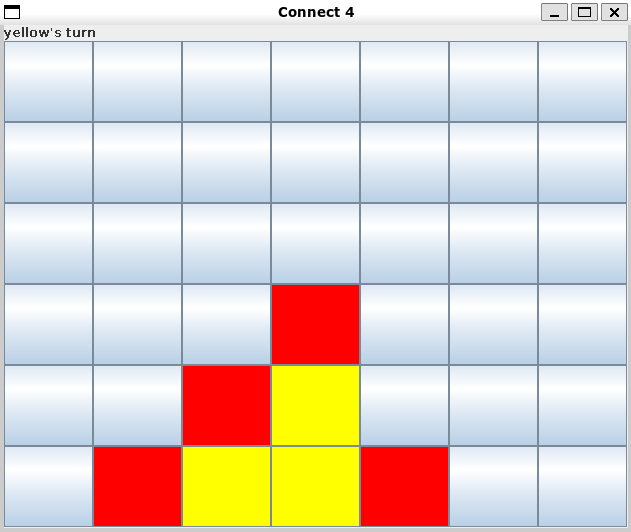

# Connect-4
This is a digital version of the classic game Connect 4. The game is built using Java and the Swing library for the GUI.

## How to run
To run the game with the UI, run the command ``make ui``.
To run the game in the terminal, run the command ``make process``.

## The board

The board is the same as the original Connect-4 game.

### The rules

The rules are the same as the original Connect-4 game.

### The Player

The player is either in red or yellow.

### How to Play

#### In the Terminal
When it is your turn, you just need to type the number of the column you want to
put your token in and press enter.

#### In the UI
When it is your turn, all you need to do is click on the column where you want to put your token.
