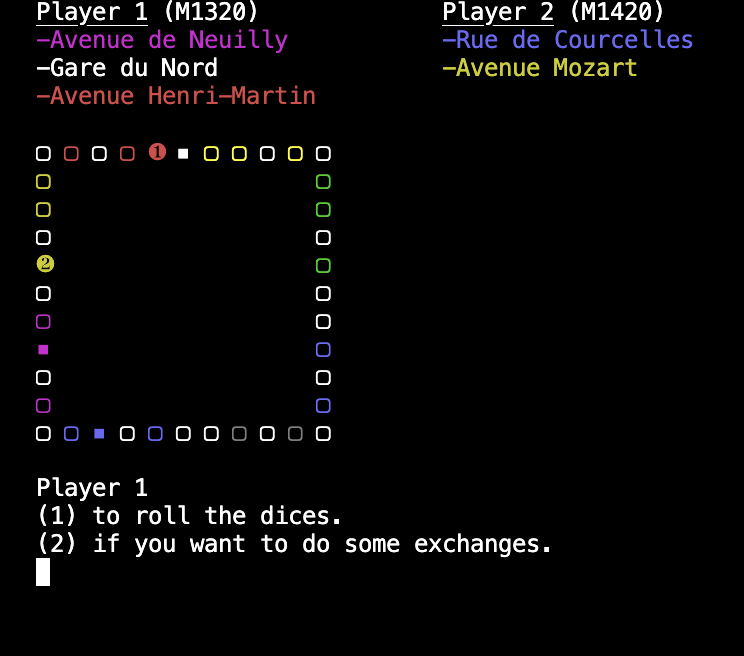

# Monopoly en Java

This Monopoly game is a console-based Java implementation, with an image of the game board displayed for a better gaming experience. The rules of the game are the same as in traditional Monopoly, where players move around a board, buy properties, pay rent and collect money.

## How to play

1. Clone the GitHub repository on your computer.
2. Open the project in your favorite development environment.
3. Run the `monopoly.java` file to start the game.
4. Follow the instructions on the screen to play.

## Features

- Display the game board in the console.

- Buy properties and pay rents.
- Manage players' money.
- Chance card system and community fund.
