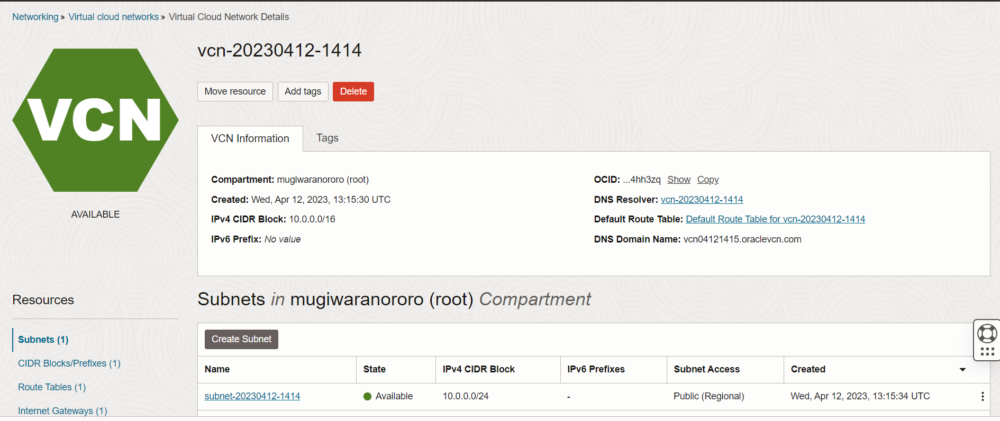
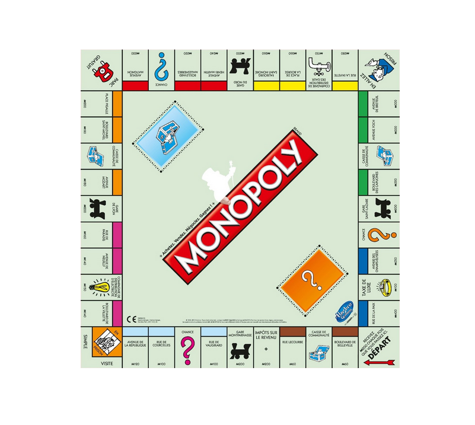
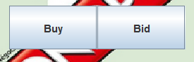
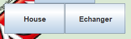
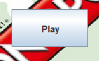
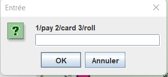

# Monopoly

## Setup

``` it uses openJDK 17.0.5 ```
``` swing is used for the GUI ```

## How to run

### The launching

``` run the main method in the Server class first```
``` with make server ```
``` then run the main method in the Player class after```
``` with make player (if you want 2 players to play the game you need to do it 2 times, 3 players 3 times etc...) ```

### The makefile

``` make server ```
``` make player ```
``` make clean ```

The code is in the src folder and the makefile move the .class files to the out/src folder
The make clean command delete the .class files in the out/src folder

## The server

The server was created with oracle, which allows us to build free server until that reach a certain number of GB of data.



## The Game

### The board



The board is the same as the original monopoly game.

### The rules

The rules are the same as the original monopoly game.

### The Player


We have 2 images for the player.

#### All the manage of the player

``` The buy button (buy the property if the player has enough money) ```
``` The bid button (bid the property weither the player do not want it or do not have the money to buy it) ```

``` The sell button (sell properties until the player has enough money to pay) ```
``` The house button (buy houses and auto-fill all the neighbour house so there is no contradiction) ```
``` The exchange button (exchange properties with somebody) ```

``` The play button (roll the dice) ```

``` The jail button (tell you to roll dice, to pay, or to show a prison card) ```

