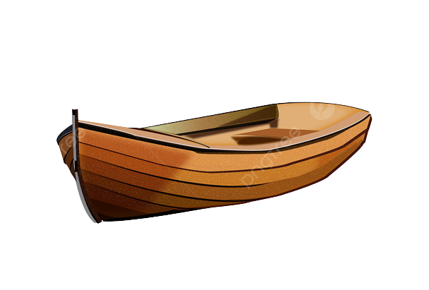

# Monopoly
This is a digital version of the popular board game Monopoly. The game is built using OpenJDK 17.0.5 and Swing for the GUI.

## Setup
Before running the game, you need to have OpenJDK 17.0.5 installed on your machine. Once you have that, you can simply download or clone the repository and run the game.


## How to run

### The launching

To run the game, follow these steps:

Run the main method in the Server class with make server.
Run the main method in the Player class with make player. If you want to play the game with multiple players, you need to run this command multiple times, once for each player (if you want 2 players to play the game you need to do it 2 times, 3 players 3 times etc...).

### The makefile

The Makefile has the following commands:

- make server: builds and runs the server
- make player: builds and runs the player
- make clean: deletes the .class files in the out/src folder

The code is in the src folder and the makefile moves the .class files to the out/src folder

## The server

The server was created with oracle, which allows us to build free server until that reach a certain number of GB of data.


## The Game

### The board


The board is the same as the original monopoly game.

### The rules

The rules are the same as the original monopoly game.

### The Player




We have 2 images for the player.

#### All the manage of the player

``` The buy button (buy the property if the player has enough money) ```

``` The bid button (bid the property weither the player do not want it or do not have the money to buy it) ```


``` The sell button (sell properties until the player has enough money to pay) ```

``` The house button (buy houses and auto-fill all the neighbour house so there is no contradiction) ```

``` The exchange button (exchange properties with somebody) ```


``` The play button (roll the dice) ```


``` The jail button (tell you to roll dice, to pay, or to show a prison card) ```


