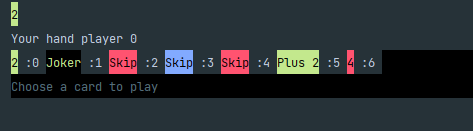

# Uno
This game is a uno game for  in the terminal 2 players.

## Launching
Compile the Java files and launch the game by running the command make in the uno/src directory.

## Rules
Each cards have a color and a number or a special effect.
The goal of the game is to have no card in the hand.
The game is turn by turn and the player can play a card if the color or the number is the same as the last card played.
If the player can't play a card he have to take a card in the deck.

As you can see in the picture above, the player can play a card if the color or the number is the same as the last card played. 
He has to choose the index of the card he wants to play.
When you finish your turn you have 5 seconds to give the computer to the other player0.
